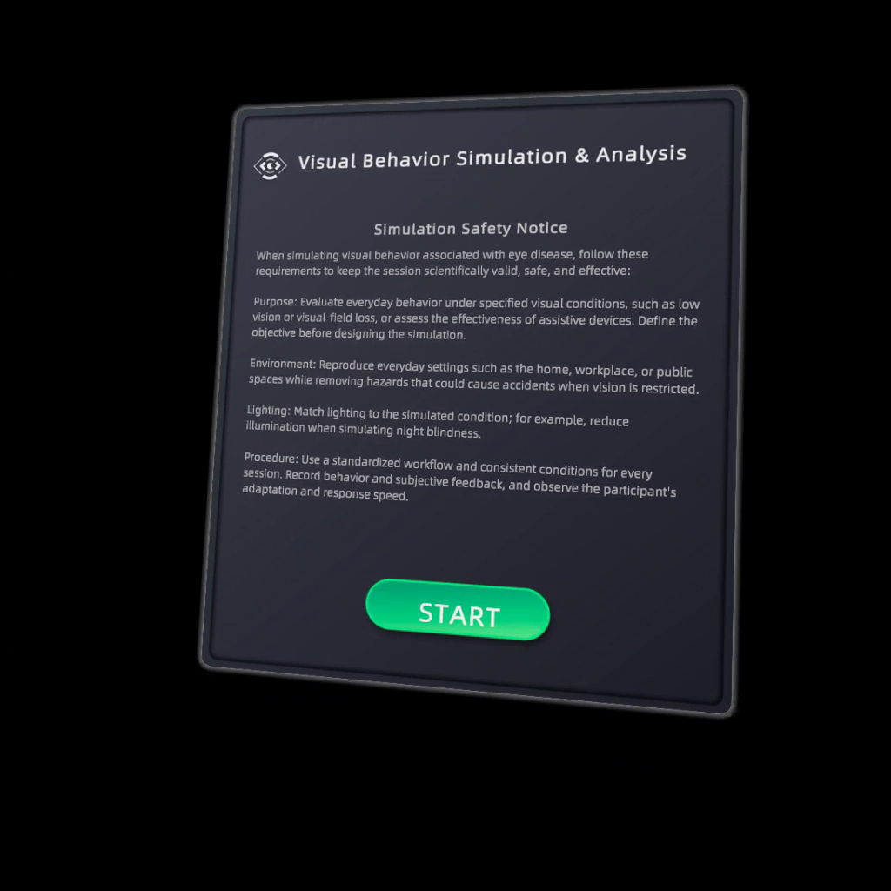
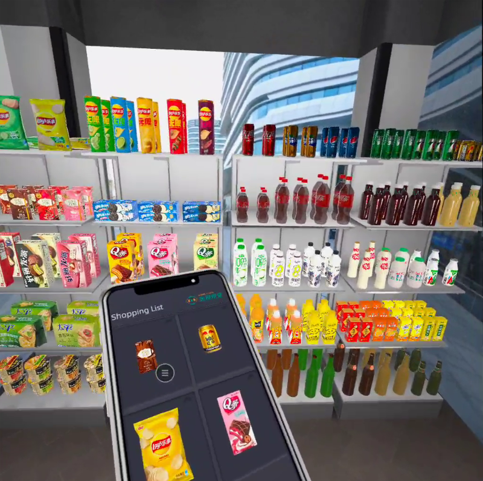
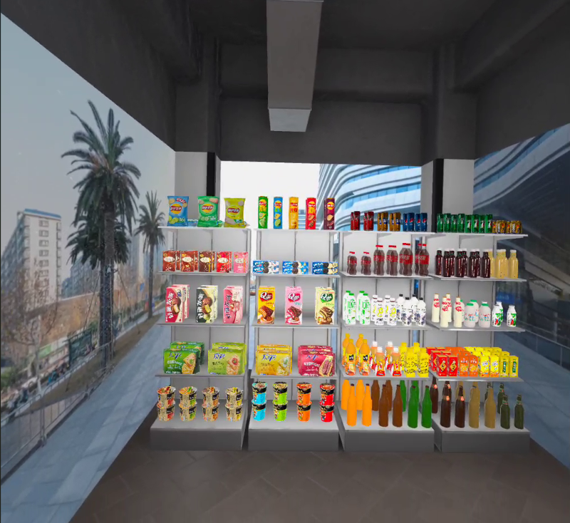
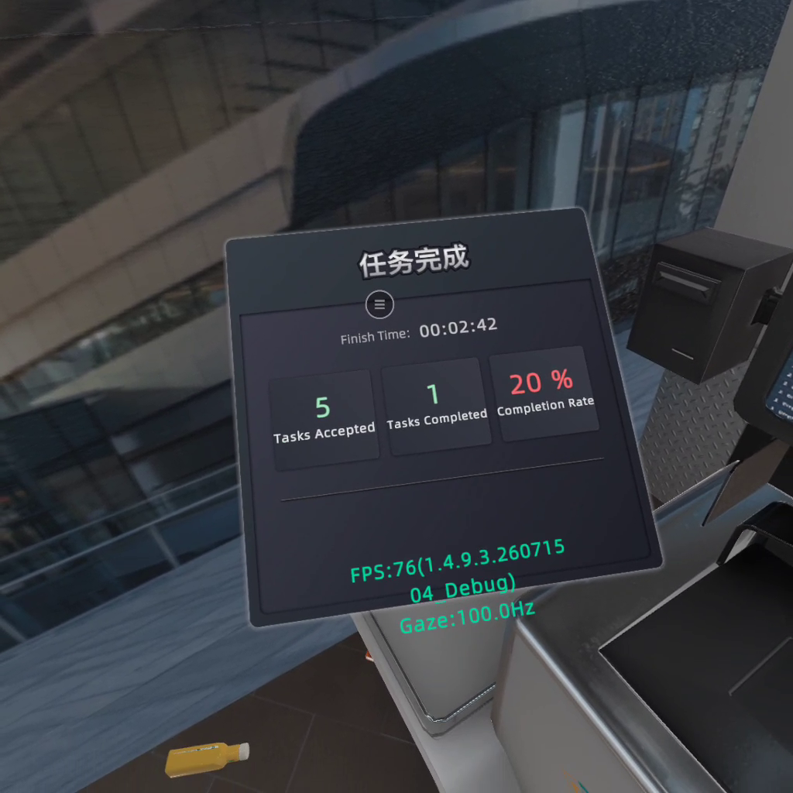
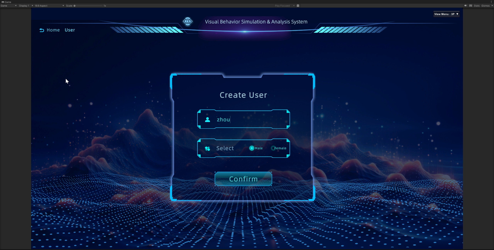
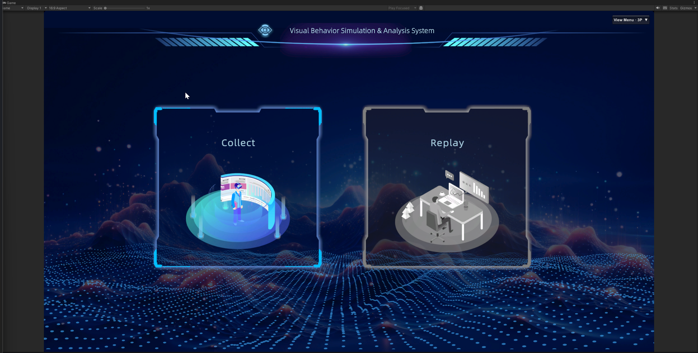
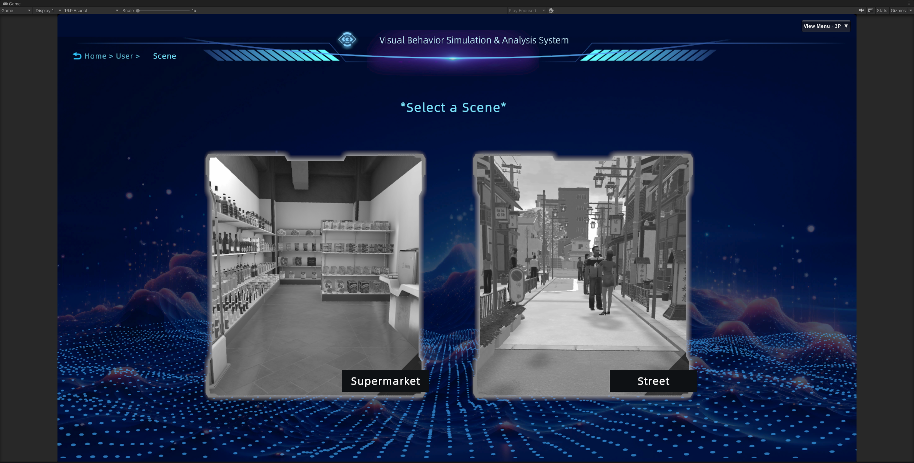
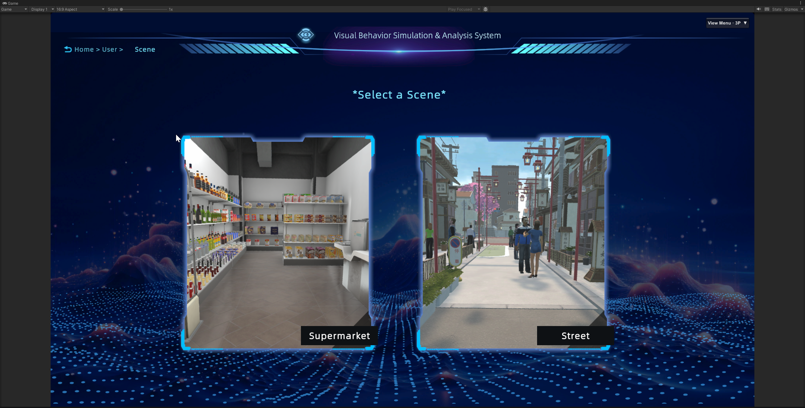
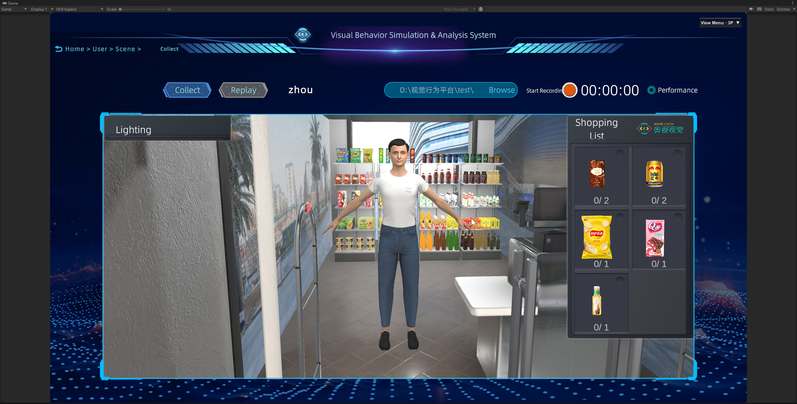
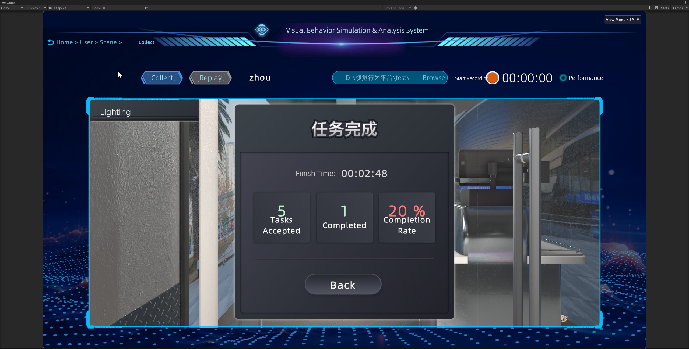

# VBSOED

**A source-only Unity snapshot for a dual-view VR behavioral experiment**

This repository is a curated snapshot of the VBSOED Unity project for public sharing, paper accompaniment, and code review. It preserves the core research code and project configuration while intentionally excluding licensed third-party packages, scenes, build artifacts, and most art assets.

> [!IMPORTANT]
> This repository is **not a runnable game distribution**. As cloned, it cannot enter Play Mode or produce the PC/Quest applications because required local packages, scenes, prefabs, AssetBundles, and art assets are not included. The operational instructions below document the complete licensed project.

## Source and version

| Item | Value |
| --- | --- |
| Original full-repository commit | `159447c26485714716aa38c5353bf4c158d770aa` |
| Original commit date | 2026-08-25 |
| Original commit message | `build(quest): refresh bundles for standard APK` |
| Unity version | 2022.3.62f3 |
| Public export date | 2026-09-05 |

The snapshot was filtered and given a new Git history, so its public commit SHA differs from the original SHA above. The original SHA is retained only for internal traceability.

## System roles

| Platform | Role | Behavior in the complete build |
| --- | --- | --- |
| Windows PC | Manager/host | Starts the Mirror host, advertises it on the LAN, manages participants and scenes, records data, and monitors the session. |
| Meta Quest Pro | Participant/client | Discovers the manager, joins the session, presents the VR task, and streams synchronized gaze/runtime data. |

The Windows build uses the `MANAGER_SERVER` scripting symbol. The Android build does not define that symbol and therefore follows the Quest client path.

## Run instructions

### Requirements for the complete licensed project

- Restore the excluded local packages, third-party components, scenes, prefabs, AssetBundles, and art assets from an authorized internal copy.
- Install Unity 2022.3.62f3 with Windows Build Support (IL2CPP) and Android Build Support, including the Android SDK, NDK, and OpenJDK.
- Enable developer access and the required eye-tracking permissions on the Meta Quest Pro.
- Connect the Windows PC and Quest headset to the same local network and allow the application through the Windows firewall on private networks.

### Build the two applications

In the restored full project:

- Build the Windows manager with the corresponding **Game Framework → Quick Build** command, which invokes `UnityGameFramework.Editor.ReleaseTools.AutomationBuild`. The project writes the executable to `Builds/Windows/Release_Windows.exe`.
- Build the Quest client with the corresponding **Game Framework → Quick Build** command, which invokes `UnityGameFramework.Editor.ReleaseTools.AutomationBuildAndroid`. The project writes Android output under `Build/Android/`.
- For the reproducible fresh-bundle Quest path, invoke `Codex.Editor.CodexQuestBuildTools.BuildAndroidPlayerWithFreshBundles`; its default output is `Build/Android/VBSOED-Quest-Pro.apk`.

### Operate a data-collection session

1. Start the Windows manager first. It starts a local Mirror host and advertises the session through LAN discovery.
2. Launch the Quest application, read the safety notice, and select **START**. The client discovers and joins the manager automatically.
3. On the manager, select **Collect**, create the participant record, and wait for the headset user to report ready.
4. Select the **Supermarket** or **Street** environment. The manager synchronizes the selected scene to the Quest client.
5. Choose a writable recording directory and enable recording or performance capture as required.
6. The participant completes the VR task while the manager monitors the synchronized view, task progress, and performance data.
7. Review the completion summary, stop recording, and return to the manager interface.

If LAN discovery fails, check that both devices are on the same subnet and that the firewall permits local traffic. The checked-in fallback endpoint `192.168.51.4:7777` is specific to the original EYE-VRLab network and should be changed or removed for other environments. Pressing `F6` in the Windows manager requests a remote Quest recenter during an active trial.

## Visual workflow

The ten screenshots originally supplied in `source_675a9d1e3b` are published here as curated documentation assets under `docs/images/workflow/`. The local mapping manifest is deliberately excluded because it contains machine-specific absolute paths.

### Quest participant view

Read left to right, then top to bottom.

| 1. Start the VR session | 2. Review the shopping list |
| --- | --- |
|  |  |
| Read the simulation safety notice in the headset and select **START**. | Use the handheld panel to review the target products before searching the shelves. |

| 3. Perform the shopping task | 4. Review task completion |
| --- | --- |
|  |  |
| Navigate the virtual supermarket and locate the requested products. | Review the elapsed time, accepted tasks, completed tasks, and completion rate. |

### PC manager view

The gallery below follows the requested presentation order. In the implemented runtime flow, the operator selects **Collect** before the participant-creation form appears; the numbered items here are therefore presentation views rather than strict click-by-click chronology.

| 1. Create a participant profile | 2. Choose the operating mode |
| --- | --- |
|  |  |
| Enter a participant identifier, select the participant attributes, and confirm the profile. | Select **Collect** for a new session or **Replay** to inspect a recorded session. |

| 3. Open scene selection | 4. Select a simulation scene |
| --- | --- |
|  |  |
| Review the available **Supermarket** and **Street** environments. | Choose the environment for the participant's session. |

| 5. Configure and record the session | 6. Review session results |
| --- | --- |
|  |  |
| Set the output location and lighting, review the targets, monitor the participant view, and start recording. | Review the finish time, accepted tasks, completed tasks, and completion rate. |

## Included content

- `Assets/GameScripts/`: core application logic, experimental workflows, eye-tracking records, networking, and runtime systems.
- `Assets/Editor/`: project-specific Quest build helpers, network tests, and shader stripping.
- `Assets/XR/`: XR loader, OpenXR, Oculus, and simulator configuration.
- `Packages/MetaQuestPro/EyeGaze/`: source for Meta Quest Pro gaze acquisition, UDP transport, gaze-point processing, and accuracy tools.
- `Packages/manifest.json` and `Packages/packages-lock.json`: original dependency declarations for review and version traceability.
- `ProjectSettings/`: Unity project configuration.
- Matching Unity `.meta` files for retained content, preserving GUID stability.

## Intentionally excluded

- Art models, textures, fonts, audio, video, PSD files, scene assets, and AssetBundles.
- `Assets/Arts/`, `Assets/AssetRaw/`, and the primary game scenes.
- Embedded source and samples from Mirror, Proxima, Didimo, YooAsset, HybridCLR, and other third-party or commercial packages.
- Native DLL/SO/EXE files, SDK archives, APKs, and other build outputs.
- Certificates, signing material, personal data, logs, and the original repository's Git history.

## Dependencies and limitations

The retained `Packages/manifest.json` references these local packages, which are not part of the public snapshot:

- `com.aovisvision.asuframework002`
- `com.code-philosophy.hybridclr`
- `com.cysharp.unitask`
- `com.didimo.sdk.core`
- `com.tuyoogame.yooasset`

The source also references Mirror and Oculus/Meta XR components. Opening this snapshot directly in Unity may therefore produce missing-assembly, material, prefab, and scene-reference errors. These omissions do not prevent source review, but a complete run or build requires authorized copies of the dependencies and assets.

## Additional documentation

- [Gaze data simulator](Assets/GameScripts/HotFix/GameLogic/Server/System/EyesTracking/Gaze/README_GazeDataSimulator.md)
- [Network performance monitor](Assets/GameScripts/Runtime/Network/PerformanceMonitor/Documentation.md)
- [Updating the repository with GitHub Desktop](GITHUB_DESKTOP_UPLOAD.md)
